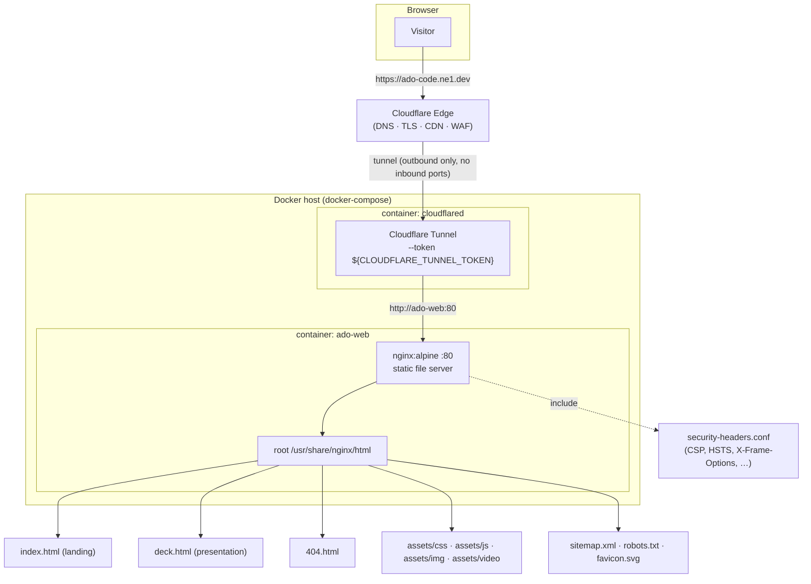
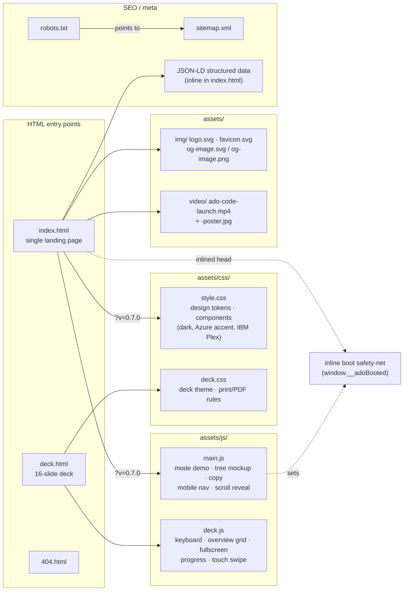
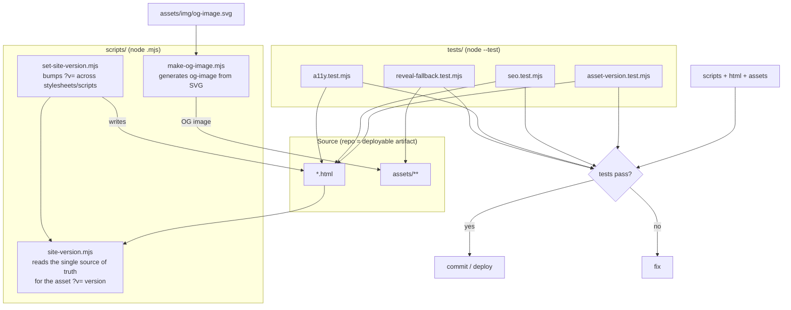
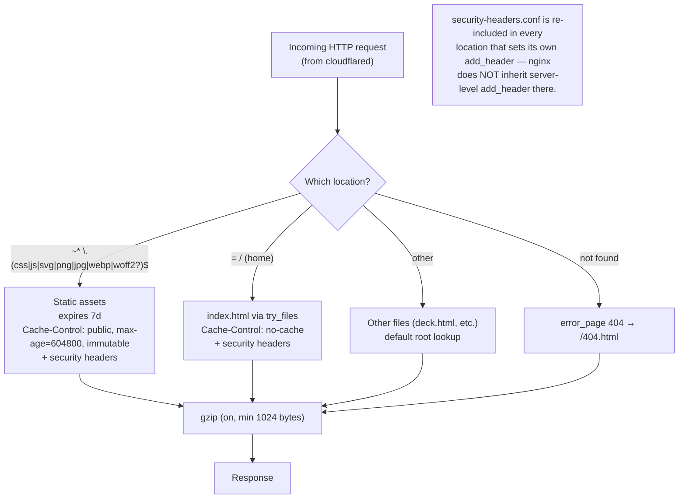

# ado-code.ne1.dev — Website Architecture

Marketing / landing site for the **ADO Code** VS Code extension.
Static HTML + CSS + vanilla JS, **no build step, no framework, no runtime
dependencies**. It deploys anywhere a static host is available; the reference
deployment is an nginx container fronted by a Cloudflare tunnel.

---

## Diagrams

Each diagram below is written as inline ```mermaid source (rendered by GitHub
and VS Code) and also exported to `docs/diagrams/` as a self-contained SVG and a
2x PNG for slides, PDFs and viewers that do not run mermaid. Regenerate the
exports with `node scripts/make-diagrams.mjs` after editing any diagram.

| # | Diagram | SVG | PNG |
| --- | --- | --- | --- |
| 1 | Runtime / deployment topology | [svg](diagrams/01-runtime-deployment-topology.svg) | [png](diagrams/01-runtime-deployment-topology.png) |
| 2 | Static file / site composition | [svg](diagrams/02-static-file-site-composition.svg) | [png](diagrams/02-static-file-site-composition.png) |
| 3 | Tooling / developer workflow | [svg](diagrams/03-tooling-developer-workflow.svg) | [png](diagrams/03-tooling-developer-workflow.png) |
| 4 | Request handling inside nginx | [svg](diagrams/04-request-handling-inside-nginx.svg) | [png](diagrams/04-request-handling-inside-nginx.png) |

---

## 1. Runtime / deployment topology

How a request flows from a browser to the served files in production.



> Exported: [SVG](diagrams/01-runtime-deployment-topology.svg) · [PNG](diagrams/01-runtime-deployment-topology.png)

Key facts:

- **Only one published port**: `3060:80` on the host (`3060` → nginx `80`). The
  tunnel container reaches nginx over the compose network by service name
  `http://ado-web:80` — **no inbound public port is exposed**.
- The **Cloudflare tunnel token lives in `.env`** (gitignored); `.env.example`
  documents the single required variable.
- The compose service name / `container_name` (`ado-web`) must stay in sync with
  the tunnel's public-hostname config in the Cloudflare dashboard.

---

## 2. Static file / site composition

The content the nginx `root` serves, and how the two HTML entry points wire up
their assets.



> Exported: [SVG](diagrams/02-static-file-site-composition.svg) · [PNG](diagrams/02-static-file-site-composition.png)

Notes:

- **`main.js`** boots the demo interactions and sets `window.__adoBooted = true`;
  an inline head script in `index.html` is a safety-net that detects a failed
  script load (if the boot flag never appears).
- **`deck.js`** is a self-contained controller for `deck.html`: ←/→/Space
  navigation, `G` overview grid, `N` speaker notes, `F` fullscreen, progress bar,
  and touch swipe.
- Assets are referenced with a **`?v=` cache-bust query string** so nginx's
  `immutable` caching can be used safely (see §4).

---

## 3. Tooling / developer workflow

There is **no build step and no `package.json`** — the files served are exactly
the files in the repo. Lightweight Node `.mjs` scripts and the Node test runner
support authoring and CI.



> Exported: [SVG](diagrams/03-tooling-developer-workflow.svg) · [PNG](diagrams/03-tooling-developer-workflow.png)

Test intent (regression guards):

- **asset-version** — the `?v=` version matches `site-version.mjs`.
- **seo** — meta/OG/JSON-LD/sitemap/robots presence.
- **a11y** — accessible markup (labels, aria, sr-only regions).
- **reveal-fallback** — guards the `querySelectorAll` alias so a single-element
  regression silently breaking scroll reveal is caught.

---

## 4. Request handling inside nginx

Caching and header behavior for the different request classes.



> Exported: [SVG](diagrams/04-request-handling-inside-nginx.svg) · [PNG](diagrams/04-request-handling-inside-nginx.png)

- **Asset URLs are versioned** (`?v=<site-version>`), so they can be cached
  `immutable` for 7 days; a version bump forces fresh fetches past the cache.
- **The home page is `no-cache`** so visitors always get the latest HTML (and
  therefore the latest asset version references).

---

## 5. Component summary

| Layer | Artifact | Responsibility |
| --- | --- | --- |
| Edge | Cloudflare | DNS, TLS, CDN, tunnel ingress |
| Tunnel | `cloudflared` container | Outbound-only link edge → host |
| Web server | nginx (`ado-web:80`) | Static serving, gzip, caching, security headers, 404 |
| Pages | `index.html`, `deck.html`, `404.html` | Content / entry points |
| Styles | `assets/css/style.css`, `deck.css` | Design system, landing + deck themes |
| Behavior | `assets/js/main.js`, `deck.js` | Landing interactions, deck controller |
| Media | `assets/img/`, `assets/img/screenshots/`, `assets/video/` | Logo, OG images, screenshot library (manifest + capture guide), launch film |
| SEO | `sitemap.xml`, `robots.txt`, inline JSON-LD | Crawlability / structured data |
| Tooling | `scripts/*.mjs` | Version bumping, OG image + architecture-diagram generation |
| Quality | `tests/*.test.mjs` | Asset-version, SEO, a11y, reveal regression, screenshot manifest ↔ PNG ↔ markup drift |
| Packaging | `Dockerfile`, `docker-compose.yml`, `nginx.conf`, `security-headers.conf`, `.env.example` | Container build & orchestration |

---

## Data-flow in one line

`browser → Cloudflare edge → cloudflared tunnel → nginx (ado-web:80) → static files in /usr/share/nginx/html`
